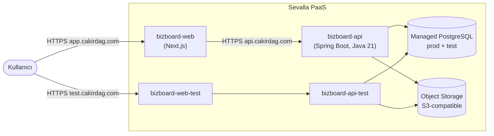

# BizBoard — DevOps Kurulum ve İşletim Rehberi (Sevalla)

> **Hedef altyapı:** [Sevalla](https://sevalla.com) PaaS — frontend ve backend ayrı uygulama olarak, Managed PostgreSQL + S3-uyumlu Object Storage ile.
> **Hedef okuyucu:** Tek DevOps operatörü (yani sen).
> **Bu doc, eski 2-VM self-hosted planının yerine geçer.** Eski plan `docs/archive/devops_setup-self-hosted.md`'de tutuluyor; PaaS'tan ayrılırsak referans olarak kalır.
> **Versiyon:** 2.0 (Sevalla)

---

## İçindekiler

1. [Mimari Genel Bakış](#1-mimari-genel-bakış)
2. [Servisler ve Sorumluluklar](#2-servisler-ve-sorumluluklar)
3. [Sevalla Hesap Hazırlığı](#3-sevalla-hesap-hazırlığı)
4. [Managed PostgreSQL Kurulumu](#4-managed-postgresql-kurulumu)
5. [Object Storage (S3-Uyumlu) Kurulumu](#5-object-storage-s3-uyumlu-kurulumu)
6. [Backend Uygulaması (`bizboard-api`)](#6-backend-uygulaması-bizboard-api)
7. [Frontend Uygulaması (`bizboard-web`)](#7-frontend-uygulaması-bizboard-web)
8. [Domain ve SSL](#8-domain-ve-ssl)
9. [Test Ortamı (`bizboard-api-test` + `bizboard-web-test`)](#9-test-ortamı)
10. [Test Verisi Senkronizasyonu](#10-test-verisi-senkronizasyonu)
11. [Backup, Restore, Disaster Recovery](#11-backup-restore-disaster-recovery)
12. [Observability](#12-observability)
13. [CI/CD](#13-cicd)
14. [Güvenlik](#14-güvenlik)
15. [İlk Deploy Checklist'i](#15-i̇lk-deploy-checklisti)
16. [Operasyonel Runbook](#16-operasyonel-runbook)
17. [Maliyet Tahmini](#17-maliyet-tahmini)

---

## 1. Mimari Genel Bakış



**Eski 2-VM planından farklar:**

| Konu | Eski (self-hosted) | Yeni (Sevalla) |
|---|---|---|
| Sunucu | 2 × VM (frontend + backend) | 4 × Sevalla App (prod web + prod api + test web + test api) |
| Reverse proxy | Kendi Caddy'imiz | Sevalla edge (Cloudflare) |
| HTTPS | Let's Encrypt manuel | Otomatik |
| PostgreSQL | Container, kendimiz | **Sevalla Managed PostgreSQL** |
| Dosyalar | Local disk + nightly S3 backup | **S3 primary** (Sevalla Object Storage) — disk yok |
| WAL backup | pgBackRest cron | Managed DB otomatik PITR |
| Firewall | ufw + WireGuard | Sevalla edge + JWT |
| Monitoring | Kendi Prometheus | Sevalla built-in + opsiyonel Prometheus scrape |

**Avantajlar:** Operatörün zamanını tüketen ~%80 iş (DB yönetimi, sertifika, reverse proxy, backup cron'ları) ortadan kalktı.
**Trade-off:** Vendor lock — ama vendor değiştirmek istersek `pg_dump` + `aws s3 sync` ile her şeyi taşıyabiliriz; mimari değişmez.

---

## 2. Servisler ve Sorumluluklar

| Sevalla servisi | Tip | Ne yapıyor | Domain |
|---|---|---|---|
| `bizboard-postgres` | Managed DB | Prod + test veritabanları (`bizboard_prod`, `bizboard_test`) | iç hostname |
| `bizboard-storage` | Object Storage bucket | Prod + test dosya yüklemeleri (`prod/`, `test/` prefix) | iç endpoint |
| `bizboard-api` | App (backend) | Spring Boot, prod | `api.cakirdag.com` |
| `bizboard-web` | App (frontend) | Next.js, prod | `app.cakirdag.com` |
| `bizboard-api-test` | App (backend) | Test, basic-auth korumalı | `test-api.cakirdag.com` |
| `bizboard-web-test` | App (frontend) | Test, basic-auth korumalı | `test.cakirdag.com` |

**Test app'leri prod ile aynı container imajını kullanır** — sadece env değişkenleri ve hedef DB/bucket farklıdır.

---

## 3. Sevalla Hesap Hazırlığı

### 3.1 Tek Sefer Yapılacaklar

1. Sevalla hesap oluştur, ödeme yöntemi ekle.
2. Bir **proje** (örn. `bizboard`) oluştur — tüm servisleri buraya koy.
3. **Region** seç: `eu-central` veya benzeri AB bölgesi (KVKK için Türkiye'ye en yakın AB tercih edilir).
4. GitHub bağlantısını yetkilendir (Sevalla → Settings → Integrations → GitHub).
5. Bir secret manager belirle (1Password, Bitwarden vb.) — bu doc'taki tüm sırlar oraya kaydedilir.

### 3.2 Reposunu Sevalla'ya Tanıt

Sevalla → Project → **Add application** → "From GitHub" → `uyekebagci/bizboard` reposunu seç. Her uygulama için **root directory** ayarlayacağız (`backend/bizboard` veya `frontend/bizboard`). Detay her bölümde.

---

## 4. Managed PostgreSQL Kurulumu

### 4.1 Servisi Oluştur

Sevalla → Project → **Add database → PostgreSQL**:

| Alan | Değer |
|---|---|
| Name | `bizboard-postgres` |
| Version | 17 (veya en güncel) |
| Plan | Hobby (1 GB RAM, 10 GB disk) — kullanıcı sayısı büyürse büyüt |
| Region | App'lerle aynı |
| Backup | Default (günlük + 7 gün retention; PITR otomatik) |

İki dakika içinde `DATABASE_URL` üretilir:

```
postgresql://bizboard_user:<password>@bizboard-postgres.sevalla.app:5432/postgres
```

### 4.2 İki Mantıksal Veritabanı

Tek bir Managed PG instance'ı, iki ayrı **logical database** taşır (prod ve test). `psql` ile bağlan ve oluştur:

```bash
psql "$ADMIN_DATABASE_URL" -c "CREATE DATABASE bizboard_prod;"
psql "$ADMIN_DATABASE_URL" -c "CREATE DATABASE bizboard_test;"
```

Spring Boot'un `SPRING_DATASOURCE_URL`'i bunlardan birini hedefler:

- **prod app:** `jdbc:postgresql://bizboard-postgres.sevalla.app:5432/bizboard_prod`
- **test app:** `jdbc:postgresql://bizboard-postgres.sevalla.app:5432/bizboard_test`

### 4.3 Bağlantı Limitleri

Hobby plan ~20 eşzamanlı bağlantı verir. Backend `application.yml`'de Hikari **maximum-pool-size: 10** (env: `DB_POOL_MAX_SIZE`). Prod + test her biri 10 = 20 → güvenli sınır.

### 4.4 Sevalla'nın Bizim Yerimize Yaptığı Backup

- Otomatik günlük snapshot — 7 gün retention (plan'a göre 14-30 gün'e çıkar)
- **PITR (Point-in-Time Recovery):** 5 dakika çözünürlükle istediğin ana geri dönebilirsin
- Restore: Sevalla UI → Database → "Restore from backup" → tarih seç
- **Sen pgBackRest cron'u yazmıyorsun.** Bu bizi `docs/archive/devops_setup-self-hosted.md` §10'daki ~500 satır kurulum yükünden kurtarır.

### 4.5 Ek Manuel Off-site Yedek (RPO/Felaket Senaryosu)

Sevalla DC'si tamamen kaybolursa diye haftada bir kendi `pg_dump`'ımızı al, başka bir yere sakla. `.github/workflows/weekly-offsite-backup.yml` (opsiyonel) → her Pazar 04:00:

```bash
pg_dump --format=custom "$PROD_DATABASE_URL" | gpg --encrypt -r ops@cakirdag.com \
  | aws s3 cp - s3://bizboard-offsite-backups/weekly/$(date +%F).dump.gpg
```

Bucket farklı bir provider'da olsun (Backblaze B2 veya AWS Glacier).

---

## 5. Object Storage (S3-Uyumlu) Kurulumu

### 5.1 Bucket'lar

Sevalla → Project → **Add storage → Object Storage** (S3-uyumlu). İki **bucket** oluştur:

| Bucket | Kullanım |
|---|---|
| `bizboard-prod-uploads` | Prod backend yazar/okur |
| `bizboard-test-uploads` | Test backend yazar/okur |

> Alternatif: tek bucket + `APP_STORAGE_S3_PREFIX=prod/` ve `test/`. İki bucket daha temiz, kazara silme riski az.

### 5.2 Erişim Anahtarları

İki tane S3 erişim anahtarı oluştur:

| Anahtar | İzin |
|---|---|
| `bizboard-prod-app` | `bizboard-prod-uploads` üzerinde RW |
| `bizboard-test-app` | `bizboard-test-uploads` üzerinde RW + `bizboard-prod-uploads` üzerinde RO (test refresh için) |

`Access Key` + `Secret Key`'leri secret manager'a kaydet. **Hiçbir zaman repoya commit etme.**

### 5.3 Bucket Versiyonlama

Her iki bucket için **object versioning** açık — yanlışlıkla silinen / üzerine yazılan dosya geri alınabilir. Retention: 30 gün.

### 5.4 Endpoint Bilgisi

Sevalla'nın object storage endpoint'i (örnek): `https://eu-central.storage.sevalla.app`. Backend env değişkenleri bunu okur:

```
APP_STORAGE_S3_ENDPOINT=https://eu-central.storage.sevalla.app
APP_STORAGE_S3_BUCKET=bizboard-prod-uploads
APP_STORAGE_S3_REGION=auto
APP_STORAGE_S3_PATH_STYLE=true
```

---

## 6. Backend Uygulaması (`bizboard-api`)

### 6.1 Sevalla App Konfigürasyonu

Sevalla → Project → **Add application → From GitHub**:

| Alan | Değer |
|---|---|
| Name | `bizboard-api` |
| Repository | `uyekebagci/bizboard` |
| Branch | `main` (auto-deploy on push) |
| Root directory | `backend` |
| Build method | **Dockerfile** (`backend/Dockerfile`) |
| Port | `8080` |
| Health check path | `/actuator/health/readiness` |
| Resources | 1 vCPU / 1 GB RAM (başlangıç) |

### 6.2 Environment Variables (Sevalla → App → Environment)

```dotenv
SPRING_PROFILES_ACTIVE=prod

# Sevalla DB linki — UI'dan "Link database" ile otomatik enjekte edilebilir.
SPRING_DATASOURCE_URL=jdbc:postgresql://bizboard-postgres.sevalla.app:5432/bizboard_prod
DB_USERNAME=bizboard_user
DB_PASSWORD=<from-sevalla-db>
DB_POOL_MAX_SIZE=10

# İlk deploy: update; schema oturduktan sonra: validate (Flyway eklemeden önce update kalsın)
JPA_DDL_AUTO=update

JWT_SECRET=<openssl rand -base64 48>
JWT_EXPIRATION_MS=604800000

APP_CORS_ALLOWED_ORIGINS=https://app.cakirdag.com,https://test.cakirdag.com

APP_STORAGE_TYPE=s3
APP_STORAGE_S3_BUCKET=bizboard-prod-uploads
APP_STORAGE_S3_REGION=auto
APP_STORAGE_S3_ENDPOINT=https://eu-central.storage.sevalla.app
APP_STORAGE_S3_ACCESS_KEY=<from-sevalla-storage>
APP_STORAGE_S3_SECRET_KEY=<from-sevalla-storage>
APP_STORAGE_S3_PATH_STYLE=true
APP_STORAGE_S3_PREFIX=

UPLOAD_MAX_SIZE_BYTES=10485760
UPLOAD_MAX_FILE_SIZE=10MB
UPLOAD_MAX_REQUEST_SIZE=15MB

AUDIT_LOG_FILE_DOWNLOADS=true
APP_EXTERNAL_INTEGRATIONS_ENABLED=true

ACTUATOR_EXPOSE=health,info,metrics,prometheus
VIRTUAL_THREADS_ENABLED=true
TZ=Europe/Istanbul
```

> Her değişiklik bir **redeploy** tetikler — Sevalla zero-downtime rolling update yapar.

### 6.3 İlk Deploy Doğrulaması

1. Build log'da `mvn package` başarılı
2. Container `bizboard-api` başlatılır → 30 sn içinde `/actuator/health/liveness` 200
3. `[storage] backend=s3 bucket=bizboard-prod-uploads` log satırı görünmeli
4. `[cors] allowed origins: [https://app.cakirdag.com, ...]` log satırı görünmeli

Hata olursa **build log + runtime log** Sevalla UI'da, ayrıca `curl https://api.cakirdag.com/actuator/health` ile dış doğrulama.

---

## 7. Frontend Uygulaması (`bizboard-web`)

### 7.1 Sevalla App Konfigürasyonu

| Alan | Değer |
|---|---|
| Name | `bizboard-web` |
| Repository | `uyekebagci/bizboard` |
| Branch | `main` |
| Root directory | `frontend` |
| Build method | **Dockerfile** (`frontend/Dockerfile`) — alternatif: Next.js otomatik buildpack |
| Port | `3000` |
| Health check path | `/` |
| Resources | 0.5 vCPU / 512 MB RAM (başlangıç) |

### 7.2 Build Args + Environment Variables

`NEXT_PUBLIC_*` değişkenleri **build time**'da bundle'a yazılır. Sevalla → App → Build → "Build args":

```
NEXT_PUBLIC_API_URL=https://api.cakirdag.com
NEXT_PUBLIC_ENV=prod
NEXT_PUBLIC_APP_VERSION=${SEVALLA_DEPLOY_ID}
```

Runtime env:

```
NODE_ENV=production
TZ=Europe/Istanbul
BACKEND_URL=https://api.cakirdag.com   # SSR fetch için
```

### 7.3 PWA Notu

Next.js next-pwa eklentisi var (`frontend/bizboard/next.config.js`). Production build PWA manifest ve service worker üretir. Sevalla statik servis ettiği için ek konfig gerekmez.

---

## 8. Domain ve SSL

Sevalla otomatik SSL sertifikası verir (Let's Encrypt arka planda).

### 8.1 Production Domain'ler

| Sevalla App | Custom domain |
|---|---|
| `bizboard-web` | `app.cakirdag.com` |
| `bizboard-api` | `api.cakirdag.com` |
| `bizboard-web-test` | `test.cakirdag.com` |
| `bizboard-api-test` | `test-api.cakirdag.com` |

### 8.2 DNS Kayıtları (GoDaddy / Cloudflare / nerede olursa)

Sevalla "Add custom domain"e basınca CNAME hedefi gösterir (örn. `xxx.cnames.sevalla.app`). DNS sağlayıcına ekle:

```
Type    Name           Value                            TTL
CNAME   app            xxx.cnames.sevalla.app           1/2 saat
CNAME   api            yyy.cnames.sevalla.app           1/2 saat
CNAME   test           zzz.cnames.sevalla.app           1/2 saat
CNAME   test-api       www.cnames.sevalla.app           1/2 saat
```

5-30 dk içinde SSL sertifikası otomatik kurulur. Sevalla bunu Verify domain → Point domain akışında izler (Çakırdağ projesinde gördüğümüz aynı süreç).

### 8.3 HTTP → HTTPS Yönlendirmesi

Sevalla varsayılan olarak HTTP → HTTPS otomatik yönlendirir. Manuel eklemeye gerek yok.

---

## 9. Test Ortamı

### 9.1 Felsefe

Test ortamı:
- **Aynı container imajı**, farklı env değişkenleri
- **Aynı Managed DB instance**, farklı logical DB (`bizboard_test`)
- **Aynı Object Storage**, farklı bucket
- Public ama **basic auth korumalı** (Sevalla edge auth feature'ı)
- `APP_EXTERNAL_INTEGRATIONS_ENABLED=false` — gerçek kullanıcılara mail/SMS gitmez

### 9.2 `bizboard-api-test` App

`bizboard-api` ayarlarının aynısı, fark olan env'ler:

```
SPRING_DATASOURCE_URL=jdbc:postgresql://bizboard-postgres.sevalla.app:5432/bizboard_test
APP_STORAGE_S3_BUCKET=bizboard-test-uploads
APP_STORAGE_S3_ACCESS_KEY=<test-app-key>
APP_STORAGE_S3_SECRET_KEY=<test-app-secret>
APP_CORS_ALLOWED_ORIGINS=https://test.cakirdag.com
APP_EXTERNAL_INTEGRATIONS_ENABLED=false
JWT_SECRET=<farklı; prod token'lar test'e geçmesin>
```

Branch: `main` (prod ile aynı koddan; sadece env'ler farklı).
Alternatif: `develop` veya `test` branch — release pipeline isteğine göre.

### 9.3 `bizboard-web-test` App

```
NEXT_PUBLIC_API_URL=https://test-api.cakirdag.com
NEXT_PUBLIC_ENV=test
```

### 9.4 Basic Auth

Sevalla → App → Settings → **Edge Auth** → enable HTTP Basic. Kullanıcı/parola secret manager'a kaydet, ekibe paylaş. Bu kullanıcı dışındakiler test'e erişemez.

---

## 10. Test Verisi Senkronizasyonu

`scripts/refresh-test-from-prod.sh` her gece prod DB ve bucket'ı test'e kopyalar (PII anonymize).

### 10.1 Tetikleme Seçenekleri

**A) GitHub Actions cron (önerilen)** — `.github/workflows/refresh-test.yml` zaten repoda. Sadece secret'lar lazım:

GitHub → Repo → Settings → Secrets and variables → Actions:

| Secret | Değer |
|---|---|
| `PROD_DATABASE_URL` | Postgres URL'i (test app ile aynı; refresh için RO de yeter) |
| `TEST_DATABASE_URL` | Test DB |
| `S3_ENDPOINT` | Sevalla Object Storage endpoint |
| `PROD_S3_BUCKET` | `bizboard-prod-uploads` |
| `TEST_S3_BUCKET` | `bizboard-test-uploads` |
| `S3_ACCESS_KEY` / `S3_SECRET_KEY` | Test app key (prod RO + test RW) |
| `S3_REGION` | `auto` |
| `TEST_API_HEALTH_URL` | `https://test-api.cakirdag.com/actuator/health/readiness` |
| `HEALTHCHECK_PING_URL` | (opsiyonel) dead-man's switch |

**B) Sevalla Scheduled Task** — Sevalla'nın cron desteği varsa aynı script `bizboard-api-test` app'i içinde scheduled task olarak da koşabilir.

### 10.2 PII Anonymisation

Script default `ANONYMIZE=true` ile çalışır. Email'ler `user+<id>@bizboard.test`, telefonlar fake, admin kullanıcısı `admin@bizboard.test` / `admin123` olarak resetlenir (sadece test'te). Detay: `scripts/refresh-test-from-prod.sh` §2b.

### 10.3 Sıklık

- **Default:** her gece 03:30 (GitHub Actions cron) — 06:30 İstanbul saatiyle, mesai başında taze veri
- İhtiyaca göre `workflow_dispatch` ile manuel tetiklenebilir

### 10.4 İzolasyon Garantileri

| Risk | Garanti |
|---|---|
| Test prod DB'sini bozar | Ayrı logical database, ayrı kullanıcı yetkisi |
| Test prod kullanıcılarına email atar | `APP_EXTERNAL_INTEGRATIONS_ENABLED=false` |
| Test prod bucket'ı bozar | Test app key'i prod bucket'a yalnız RO erişimli |
| Test'in açık olması veri sızdırır | Basic auth + PII anonymisation |

---

## 11. Backup, Restore, Disaster Recovery

### 11.1 Kim Neyi Yedekliyor

| Veri | Birinci yedek | İkinci yedek (off-site) |
|---|---|---|
| **PostgreSQL** | Sevalla Managed PITR (otomatik, ≤5 dk RPO) | Haftalık `pg_dump` → 3. taraf S3 (manuel/CI) |
| **Object Storage** | Bucket versioning (otomatik, 30 gün) | Haftalık `aws s3 sync` → 3. taraf bucket |
| **Konfig** | GitHub repo (commit history) | Sevalla "Export config" haftalık |

### 11.2 RPO / RTO

| Senaryo | RPO | RTO | Aksiyon |
|---|---|---|---|
| DB silindi (yanlış migration) | ≤5 dk | <30 dk | Sevalla UI → Restore PITR |
| DB pod crash / hardware | <1 dk | <5 dk | Sevalla auto-failover; bekle |
| Tüm Sevalla DC kaybı | ≤7 gün | 4 saat | Off-site dump'tan başka provider'a kur; CNAME değiştir |
| Bucket bütün silindi | 0 (versioning) | <15 dk | Sevalla UI → versioning restore; veya off-site sync |
| Kod regression | 0 | <2 dk | GitHub → previous commit → Sevalla auto-deploy |

### 11.3 Off-Site Backup Workflow

`.github/workflows/weekly-offsite-backup.yml` (opsiyonel, sonradan eklenecek):

```yaml
on:
  schedule: [{ cron: "0 4 * * 0" }]   # Pazar 04:00
jobs:
  backup:
    runs-on: ubuntu-latest
    steps:
      - run: pg_dump --format=custom "$PROD_DATABASE_URL" | gpg -e -r ops@cakirdag.com | aws s3 cp - s3://bizboard-offsite/db-$(date +%F).dump.gpg
      - run: aws s3 sync s3://bizboard-prod-uploads/ s3://bizboard-offsite/uploads/ --storage-class GLACIER
```

GPG key'i + offsite provider key'i secret manager'da.

### 11.4 Restore Drill (Aylık)

Ayın 1'inde, `bizboard-api-test` app'ini durdur → 1 hafta önceki Managed DB snapshot'ına geri yükle → smoke test → bizboard-api-test'i tekrar başlat. Sonuç metrikleri:
- Restore süresi (RTO doğrulaması)
- Veri bütünlüğü (`SELECT COUNT(*) FROM transactions` vb. prod ile karşılaştır)

---

## 12. Observability

### 12.1 Sevalla'nın Verdiği

| Metrik | Nerede |
|---|---|
| CPU, RAM, network per app | Sevalla → App → Metrics |
| HTTP request count, latency, error rate | Sevalla → App → Logs (HTTP access log) |
| DB connections, slow queries | Sevalla → Database → Metrics |
| Container restart events | Sevalla → App → Events |

### 12.2 Spring Boot Actuator Endpoint'leri

`ACTUATOR_EXPOSE=health,info,metrics,prometheus` (env). Tüm endpoint'ler `/actuator/...`:

| Endpoint | Erişim | Kullanım |
|---|---|---|
| `/actuator/health` | public | Genel sağlık |
| `/actuator/health/liveness` | public | K8s/Sevalla liveness probe — JVM hayatta mı |
| `/actuator/health/readiness` | public | DB bağlantısı dahil; trafik kabul edebilir mi |
| `/actuator/info` | public | Spring profile, app name |
| `/actuator/metrics` | public | Micrometer counter'ları |
| `/actuator/prometheus` | public | Scrape edilebilir format |

> Bunlar `permitAll` SecurityConfig'de. Sensitive bir şey expose etmiyorlar.

### 12.3 Custom Log: `requestId`

`application-prod.yml` logback pattern'inde `%X{requestId}` var. İleride bir Filter ekleyip her isteğe UUID atanabilir; şu an için boş kalır.

### 12.4 Alerting

Sevalla → Project → Alerts:
- Memory > 85% — 10 dakika
- HTTP 5xx oranı > 1% — 5 dakika
- DB connections > %80 pool — 5 dakika
- Container restart loop — anında

Slack/email webhook bağla.

---

## 13. CI/CD

### 13.1 Default Akış

```
git push origin main           ┐
                               │
GitHub repo                    │
   │                           │
   ▼                           │
Sevalla webhook                │
   │                           │
   ▼                           │
Docker build (Sevalla side)    │
   │                           │
   ▼                           │
Smoke test + rolling deploy   ◄┘ <2-5 dk
```

Branch koruması: GitHub → Settings → Branches → `main` requires PR + 1 review (sen tek geliştiricisin diye sahip onayı yeterli; ileride genişletirsen ayarla).

### 13.2 Test Önce, Sonra Prod

Önerilen: prod app `main` branch'inden, test app `develop` branch'inden deploy olsun. Bir geliştirme akışı:

```
git checkout develop
# ... commit ...
git push                       → bizboard-web-test + bizboard-api-test redeploy
# kullanıcı kabul testi
git checkout main && git merge develop
git push                       → bizboard-web + bizboard-api redeploy
```

Hızlı rollback: GitHub'da revert commit + push, ya da Sevalla → App → Deployments → "Redeploy previous".

### 13.3 GitHub Actions Workflow'ları

| Workflow | Tetik | Ne yapıyor |
|---|---|---|
| `.github/workflows/refresh-test.yml` | cron `30 3 * * *` + manuel | Test verisi senkronu |
| (opsiyonel) `weekly-offsite-backup.yml` | cron Pazar 04:00 | Off-site DB + bucket yedek |
| (opsiyonel) `lint-and-test.yml` | her PR | `mvn verify` + `npm run lint` |

---

## 14. Güvenlik

### 14.1 Network

- Backend ve frontend Sevalla edge'inin arkasında — direkt IP üzerinden erişim mümkün değil
- HTTPS otomatik; HTTP → HTTPS yönlendirme default
- Backend'in CORS'u sadece `APP_CORS_ALLOWED_ORIGINS`'deki origin'lere açık (örn. `https://app.cakirdag.com`)
- Test app'leri basic auth ile sınırlı

### 14.2 Kimlik / Yetki

- JWT, `JWT_SECRET` ile imzalı (`openssl rand -base64 48` ile üret, secret manager'da sakla)
- Token expiration 7 gün (env `JWT_EXPIRATION_MS`); refresh akışı henüz yok — login tekrar gerekli
- Admin endpoint'leri `hasRole("ADMIN")` korumalı (SecurityConfig)

### 14.3 Audit

- Her dosya download/delete `audit_logs` tablosunda kayıt — kim, ne zaman, hangi IP, hangi User-Agent
- Tablo şeması `AuditLog.java`'da; `metadata` jsonb ileri kullanım için schemaless
- Retention: şimdilik sınırsız; 1 yıl sonra cron ile `DELETE WHERE created_at < NOW() - INTERVAL '1 year'` ekle

### 14.4 Dosya Yükleme

| Kontrol | Konum |
|---|---|
| MIME whitelist (image + doc) | `FileStorageService.ALL_ALLOWED_TYPES` |
| Boyut limiti (10 MB) | `app.file.max-size-bytes` + servlet multipart |
| Path traversal blok | `LocalFileStorageAdapter.resolveSafe` (S3'te key prefix'i zorunlu) |
| Filename sanitisation | `FileController.sanitiseFilename` (Content-Disposition için) |

İleride: ClamAV ile asenkron virüs taraması; şimdi kapsam dışı.

### 14.5 Secret Yönetimi

- **Hiçbir secret repoya commit edilmez** — `.env` örnekleri `.env.example` olarak duruyor
- Tüm prod secret'ları **Sevalla Environment Variables**'ta (encrypted at rest)
- Senin lokal `.env`'in `.gitignore`'da
- 6 ayda bir `JWT_SECRET` rotation (gerçekleştiğinde tüm kullanıcılar tekrar login)

### 14.6 GDPR / KVKK Notları

- Kullanıcı silme talebi: `users` row sil → cascade ile `audit_logs.user_id` null'a düşmez (denormalised `user_name` korunur — bu compliance açısından sorun, ileride hashing'e geç)
- Veri ihracı: bir endpoint eklenmeli (`/api/users/me/export` → tüm kayıtlar JSON), sonradan ekle
- Veri lokasyonu: Sevalla `eu-central` region → AB içi → KVKK için kabul edilebilir

---

## 15. İlk Deploy Checklist'i

### Faz 1 — Sevalla altyapı (30 dk)
- [ ] Sevalla projesi `bizboard` oluştur, region `eu-central`
- [ ] Managed PostgreSQL `bizboard-postgres` — Hobby plan
- [ ] `psql` ile `bizboard_prod` ve `bizboard_test` DB'leri oluştur
- [ ] Object Storage: `bizboard-prod-uploads`, `bizboard-test-uploads`
- [ ] Bucket versioning aç (30 gün retention)
- [ ] Access key + secret 2 set: `bizboard-prod-app`, `bizboard-test-app`
- [ ] GitHub OAuth bağlantısı kuruldu

### Faz 2 — Backend prod (20 dk)
- [ ] App `bizboard-api`, root `backend`, Dockerfile build
- [ ] Tüm env değişkenler set edildi (§6.2)
- [ ] DB linklendi (Sevalla UI'dan)
- [ ] İlk deploy başarılı, log'da `[storage] backend=s3` görünüyor
- [ ] `curl https://<sevalla-default-domain>/actuator/health/readiness` 200 dönüyor

### Faz 3 — Frontend prod (15 dk)
- [ ] App `bizboard-web`, root `frontend`, Dockerfile build
- [ ] Build args + runtime env set
- [ ] İlk deploy başarılı
- [ ] Default domain'de UI açılıyor

### Faz 4 — Custom domain (15 dk + DNS propagasyon)
- [ ] DNS sağlayıcına CNAME kayıtları eklendi (§8.2)
- [ ] Sevalla her app için custom domain verify olduğunu gösteriyor
- [ ] Browser'da `https://app.cakirdag.com` SSL'li açılıyor
- [ ] Login akışı çalışıyor

### Faz 5 — Test ortamı (20 dk)
- [ ] App `bizboard-api-test` + `bizboard-web-test` oluşturuldu
- [ ] Test env değişkenleri set (§9.2, §9.3)
- [ ] Sevalla edge auth (basic auth) test app'lerinde aktif
- [ ] `test.cakirdag.com` basic auth ile açılıyor

### Faz 6 — Test sync (10 dk)
- [ ] GitHub repo secrets eklendi (§10.1)
- [ ] `.github/workflows/refresh-test.yml` çalıştırması manuel tetiklendi → yeşil
- [ ] Test DB'de prod verisi (anonimize) görünüyor

### Faz 7 — Observability + alerting (15 dk)
- [ ] Sevalla alerts: memory, error rate, DB pool, restart loop
- [ ] Slack/email webhook bağlandı
- [ ] Sahte alarm tetiklendi, mesaj geldi mi doğrula

### Faz 8 — Backup drill (10 dk)
- [ ] Sevalla PITR ile test DB 1 saat öncesine restore edildi → çalışıyor
- [ ] `pg_dump` ile manuel off-site dump alındı, başka bir yere yüklendi

### Faz 9 — Smoke (5 dk)
- [ ] Yeni kullanıcı kayıt + login akışı
- [ ] Dosya upload (resim + PDF)
- [ ] Dosya download (audit log'da kayıt var mı kontrol)
- [ ] İşletme ekle / transaction ekle / sil → DB'de görünüyor

---

## 16. Operasyonel Runbook

### 16.1 Günlük

- [ ] Sevalla → All apps green
- [ ] Test refresh job dün gece geçti mi (GitHub Actions sekme)

### 16.2 Haftalık

- [ ] Off-site backup workflow geçti mi
- [ ] Sevalla DB metrics: connection pool tepe %50'nin altında mı
- [ ] Disk kullanım trend: backend disk doluluk seyri (Sevalla otomatik büyüten plana al)

### 16.3 Aylık

- [ ] Restore drill (Faz 8'i tekrar et)
- [ ] Audit log'da anormal aktivite tarama (`SELECT action, COUNT(*) FROM audit_logs WHERE created_at > NOW() - INTERVAL '30 days' GROUP BY action`)
- [ ] Bağımlılık güncellemeleri: `mvn versions:display-dependency-updates` + Dependabot PR'larını incele
- [ ] Sevalla maliyet incelemesi (§17)

### 16.4 Yaygın Senaryolar

| Sorun | Komut / aksiyon |
|---|---|
| Backend 502 | Sevalla App → Logs; readiness probe başarısız mı; DB linkini test et |
| DB connection exhausted | `SELECT pid, query, state FROM pg_stat_activity WHERE state != 'idle'`; uzun süren sorguyu kapat |
| Dosya yüklenmiyor | Backend log'da `S3 putObject failed`; access key süresi dolmuş mu, bucket dolmuş mu |
| Frontend eski sürüm | Sevalla → App → Deployments → "Redeploy latest" (browser cache busting CDN tarafından otomatik) |
| Migration hatası | Sevalla auto-rollback'i tetiklenir; commit'i geri al, push at |
| Heap OOM | App Memory'i bir tier büyüt; `/tmp/heap.hprof` dump'ı download → Eclipse MAT |

---

## 17. Maliyet Tahmini

Sevalla starter setup için yaklaşık aylık (USD, 2026):

| Kaynak | Birim | Tahmin |
|---|---|---|
| `bizboard-api` (1 vCPU / 1 GB) | $15 | $15 |
| `bizboard-web` (0.5 vCPU / 512 MB) | $7 | $7 |
| `bizboard-api-test` (0.5 vCPU / 512 MB) | $7 | $7 |
| `bizboard-web-test` (0.25 vCPU / 256 MB) | $4 | $4 |
| `bizboard-postgres` Hobby (1 GB / 10 GB) | $15 | $15 |
| Object Storage (50 GB + light egress) | $3 | $3 |
| **Toplam** | | **~$51/ay** |

Off-site backup (3. taraf S3 ücreti): ~$2-5/ay ek.

**Karşılaştırma:** Self-hosted 2-VM:
- 2 × VPS ($10 + $20) = $30
- Block storage 100 GB = $10
- Off-site S3 = $5
- Domain + SSL = $1
- **Toplam: ~$46/ay**
- **+ Operasyon zamanı:** ~5-10 saat/ay (DB yönetimi, sertifika yenileme, log analizi, security patch'leri)

Sevalla farkı: ~$5/ay daha pahalı, **operasyon zamanı ~%80 az.** Tek operatör için tercih sebebi.

---

## Bu Doc'un Bakımı

- Yeni bir hizmet eklendiğinde (örn. Redis), §2 ve §15'i güncelle
- Plan büyütüldüğünde (`bizboard-api` Standard'a geçirildi vb.), §17 ve §6.1'i revize et
- Eski mimari hâlâ relevant değil → `docs/archive/devops_setup-self-hosted.md`'i silme; alternative reference olarak değerli

---

**Versiyon:** 2.0 (Sevalla) — 2026-05-12. Eski 2-VM planı `docs/archive/devops_setup-self-hosted.md`.
